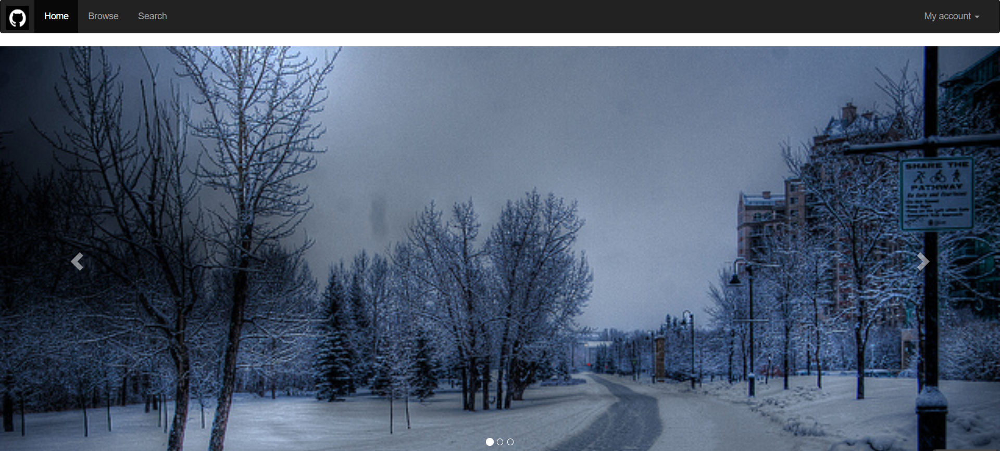

LAB 4 设计文档

=========

### 主页截图

-------------------

### 布局
主页主体由两块构成。
一块为导航栏，左侧包含logo以及home,browser,search。为“collapse navbar-collapse”类，以列表布局。
右侧包含My account，为下拉栏，为“nav navbar-nav nav-pills navbar-right”类，以列表布局。

另一块是滚动展示三张图片的展示区。为“carousel slide”类，以"carousel-indicators"类的列表作为indicators,以“carousel-inner”类的区块里的三张图片作为wrappers，用超链接做controls.

